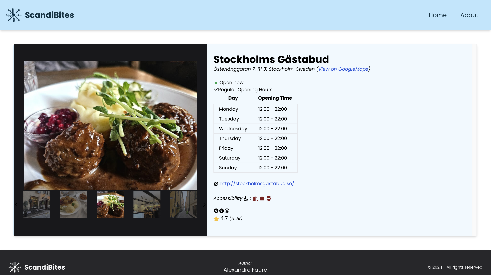

# ScandiBites

## Description

ScandiBites is a Guide-Like website for restaurants. It relies on: React, Typescript, Fastify, Google Places API (New), Leaflet, TailwindCSS and PrimeReact.

## Installation

To use the code, you can clone the repository:

```bash
git clone <repository-url>
```

Then, you can install the dependencies in the `./frontend` and `./backend` folders:

```bash
npm install
```

You'll also need to create a `.env` file in the `./backend` folder with the following content:

```bash
GOOGLE_PLACES_API_KEY=<your-api-key>
```

Please, make sure to replace `<your-api-key>` with your own Google Places API key (you can get one [here](https://developers.google.com/maps/documentation/places/web-service/get-api-key)).

## Usage

To start the frontend, you can run:

```bash
npm start
```

To start the backend, you can run:

```bash
npm run start
```


## Deployment

To deploy the website, you can use docker-compose:

```bash
docker-compose up --build # To build the images
docker-compose up # To start the containers without rebuilding the images
```

You'll then be able to access the website at `http://localhost:80` while the API will be available at `http://localhost:5000`.

## Preview

Here are two screenshots of the website:

This is the home page:


By clicking on a restaurant, you can see more details about it:



## License

GNU General Public License v3.0

## Ideas for improvement

- [ ] Add a search bar
- [ ] Add a filter system

## Author

If you have any questions, feel free to contact me:

- Alexandre Faure (developer): [alexandre.faure@student-cs.fr](mailto:alexandre.faure@student-cs.fr)